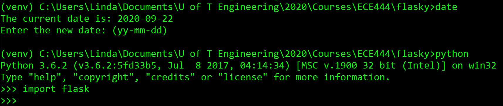
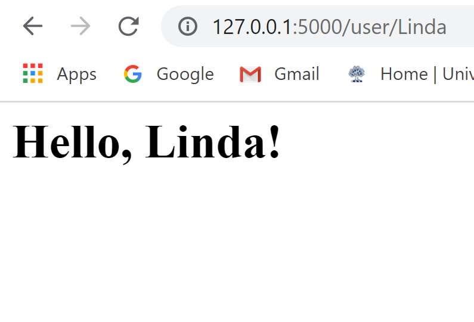

# ECE444-F2020-Lab2
Linda Wu

This repo is a clone of https://github.com/miguelgrinberg/flasky

Activity 1:

Activity 2:

Activity 3:
The Flask context global is an object that the application can use for temporary storage when handling a request. This variable is then reset with each request.
